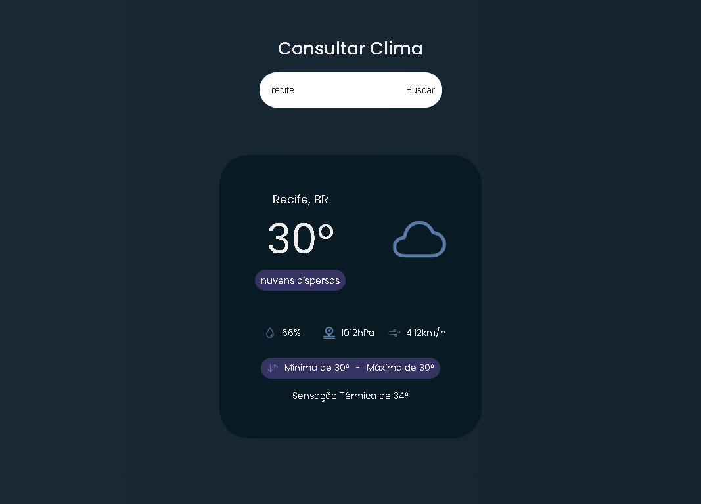

## Weather App

Application to check the current weather around the city, Using Public API

## Technology

Here are the technologies used in this project.

- HTML5
- CSS3
- Javascript

## Services Used

- Github
- Netlify

## Getting started

- Dependency

- Create an account and generate a key on the website "https://openweathermap.org/api", deploy in the variable "KeyAPI" in the script.js file.

## How to use

### 1 - Page on large screens

## Features

The main features of the application are:

- Consult the Climate of Any City in the World.

## Links

- Deploy on Netlify: https://js-app-weather.netlify.app/
- Repository: https://github.com/brunorguerra/weatherApp

## Versioning

1.0.0.0

## Authors

- **Bruno Bernardes Guerra**

Please follow github and join us!
Thanks to visiting me and good coding!
